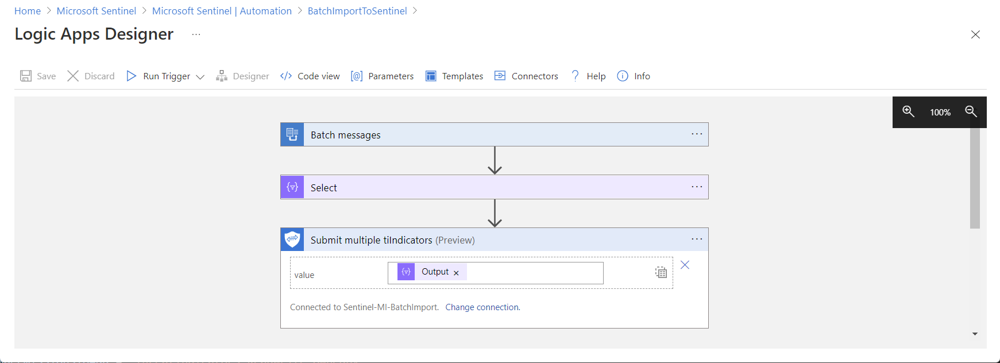
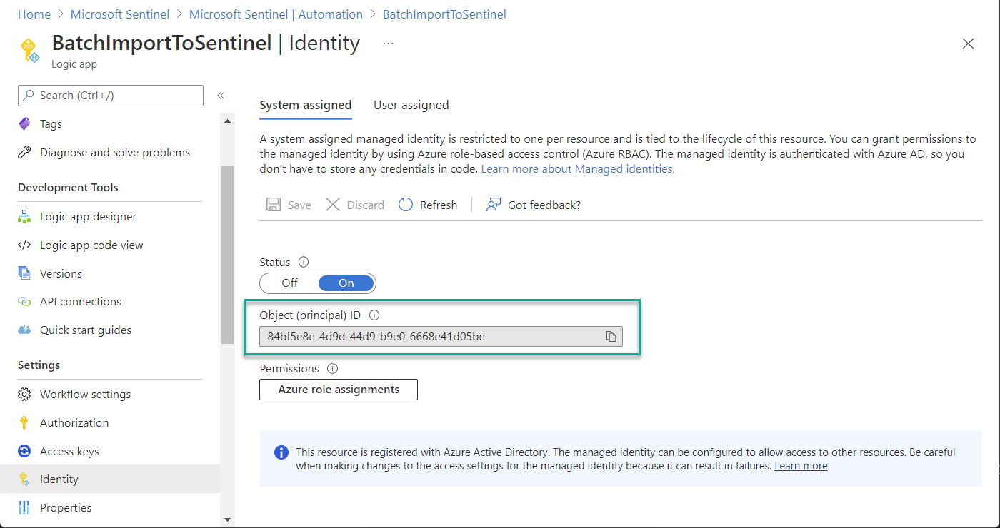
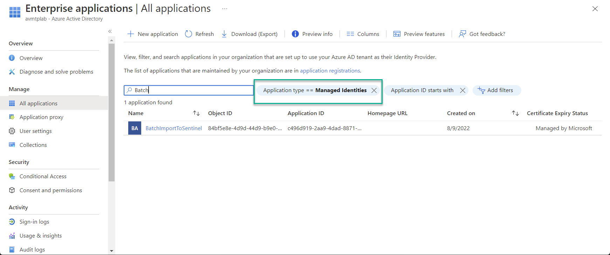
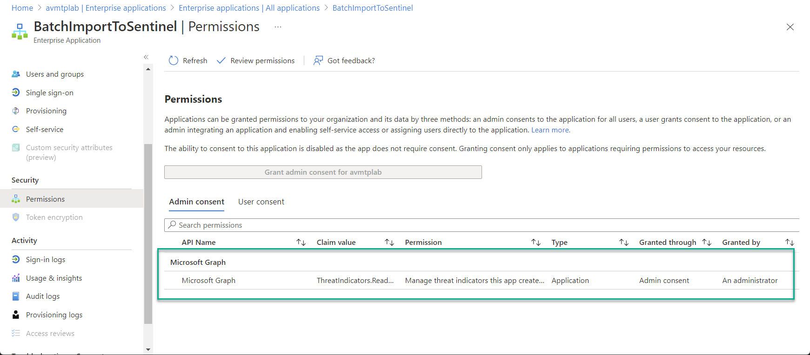

# BatchImportSentinel

## Description

The ***BatchImportSentinel*** Playbook is triggered by other Playbooks that retrieve threat intelligence feed information.

The ***BatchImportSentinel*** playbook is used to submit multiple threat indicators to the Sentinel Intelligence Platform.



The API connection for the ***Submit Multiple Indicators*** step uses as Managed Identity. Follow the below steps to grant the Managed Identity access to the Microsoft Graph API for submitting Threat Indicators.

## Deployment

[](https://portal.azure.com/#create/Microsoft.Template/uri/https%3A%2F%2Fraw.githubusercontent.com%2Falexverboon%2FSentinel-Content-Dev%2Fmain%2FPlaybooks%2FTIBatchImportSentinel%2Fazuredeploy.json
)

[](https://portal.azure.us/#create/Microsoft.Template/uri/https%3A%2F%2Fraw.githubusercontent.com%2Falexverboon%2FSentinel-Content-Dev%2Fmain%2FPlaybooks%2FTIBatchImportSentinel%2Fazuredeploy.json
)

## Grant Permissions to Managed Identity

1. Obtain the Object ID of the managed identity.


2. You can find the Object ID of the managed identity also in the Azure Portal.


3. Run the following PowerShell command to grant the Managed Identity the ***ThreatIndicators.ReadWrite.OwnedBy*** permission to the Microsoft Graph API.

```powershell

# The objectID of the Managed Identity
$spObjectID = "<REPLACE WITH THE OBJECTID>"

# The app ID of the Microsoft Graph
$appId = "00000003-0000-0000-c000-000000000000"

# Permissions required to add ThreatIndicators
$permissionsToAdd = "ThreatIndicators.ReadWrite.OwnedBy"

Connect-AzureAD
$app = Get-AzureADServicePrincipal -Filter "AppId eq '$appId'"
foreach ($permission in $permissionsToAdd)
{
   $role = $app.AppRoles | where Value -Like $permission | Select-Object -First 1
   New-AzureADServiceAppRoleAssignment -Id $role.Id -ObjectId $spObjectID -PrincipalId $spObjectID -ResourceId $app.ObjectId
}
```

4. Verify the permissions are granted.



## Removing Permissions from Managed Identity

If you no longer need the permissions to add Threat Indicators, you can remove the permissions by running the following PowerShell command.

```powershell
Connect-AzureAD
# Get Service Principal using objectId
$sp = Get-AzureADServicePrincipal -ObjectId "<REPLACE WITH THE OBJECTID>"

# Get all application permissions for the service principal
$spApplicationPermissions = Get-AzureADServiceAppRoleAssignedTo -ObjectId $sp.ObjectId -All $true | Where-Object { $_.PrincipalType -eq "ServicePrincipal" }

# Remove all delegated permissions
$spApplicationPermissions | ForEach-Object {
   Remove-AzureADServiceAppRoleAssignment -ObjectId $_.PrincipalId -AppRoleAssignmentId $_.objectId
}
```
