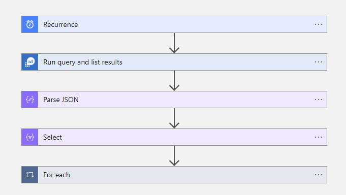
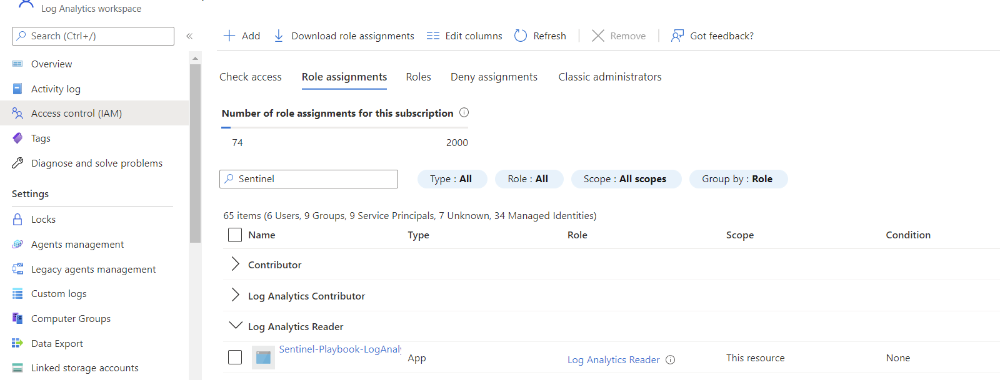
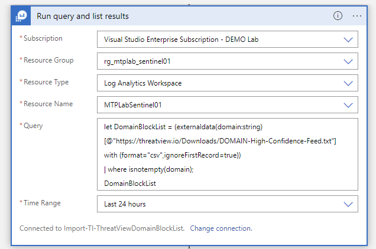
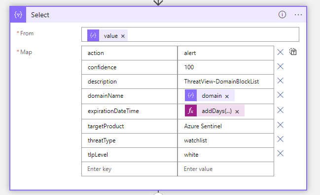

# Import-TI-ThreatView Domain Blocklist

author: Alex Verboon

This playbook ingest threat indicators into Microsoft Sentinel.

Threat Intellgience Source: [ThreatView](https://threatview.io/) [Domain Blocklist](https://threatview.io/Downloads/DOMAIN-High-Confidence-Feed.txt)

## Prerequisites

1. This playbook has a dependency on the [BatchImportToSentinel](../TIBatchImportSentinel/readme.md) playbook
2. The Service principal must have access to the Sentinel Log Analytics workspace

## Deployment

Before deploying this playbook, make sure you have the [BatchImportToSentinel](../TIBatchImportSentinel/readme.md) playbook deployed

## Configuration

* After importing the playbook, open the playbook and configure the connection for the Azure Monitor connector. Configure the API connection to connect with a service principal.

* Optionally, configure the Threat Intelligence data import settings, such as the expiration time for the imported TI.

## Result

ThreatIntelligenceIndicator
| where SourceSystem == "SecurityGraph"
| where Description == "ThreatView-DomainBlockList"

