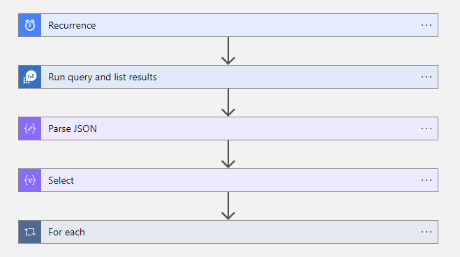
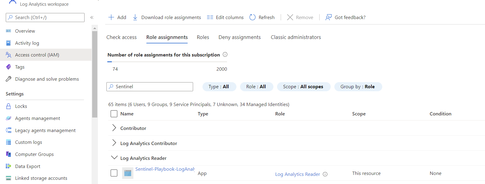
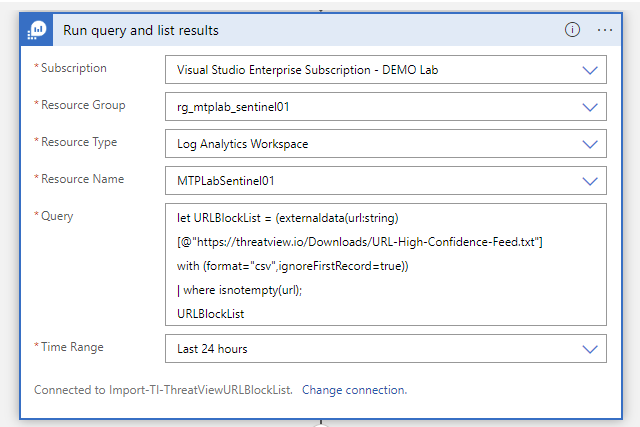
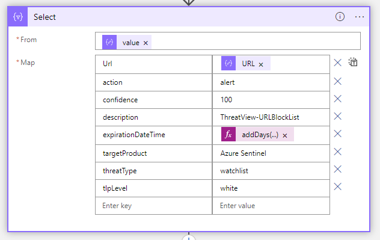

# Import-TI-ThreatView URL Block List

author: Alex Verboon

This playbook ingest threat indicators into Microsoft Sentinel.

Threat Intellgience Source: [ThreatView](https://threatview.io/) [URL Blocklist](https://threatview.io/Downloads/URL-High-Confidence-Feed.txt)



## Prerequisites

1. This playbook has a dependency on the [BatchImportToSentinel](../TIBatchImportSentinel/readme.md) playbook
2. The Service principal must have access to the Sentinel Log Analytics workspace


## Deployment

Before deploying this playbook, make sure you have the [BatchImportToSentinel](../TIBatchImportSentinel/readme.md) playbook deployed

[](https://portal.azure.com/#create/Microsoft.Template/uri/https%3A%2F%2Fraw.githubusercontent.com%2Falexverboon%2FSentinel-Content-Dev%2Fmain%2FPlaybooks%2FThreatView_URLBlockList%2Fazuredeploy.json)

[](https://portal.azure.us/#create/Microsoft.Template/uri/https%3A%2F%2Fraw.githubusercontent.com%2Falexverboon%2FSentinel-Content-Dev%2Fmain%2FPlaybooks%2FThreatView_URLBlockList%2Fazuredeploy.json)

## Configuration

* After importing the playbook, open the playbook and configure the connection for the Azure Monitor connector. Configure the API connection to connect with a service principal.



* Optionally, configure the Threat Intelligence data import settings, such as the expiration time for the imported TI.




## Result

```kusto
ThreatIntelligenceIndicator
| where SourceSystem == "SecurityGraph"
| where Description == "ThreatView-IPBlockList"
```


