# Watchlist-NetWork-Addresses

## Description

The playbook ***Watchlist-NetWork-Addresses*** check if any of the Incident IP Address entities is within the range of the ***Network Addresses*** watchlist.

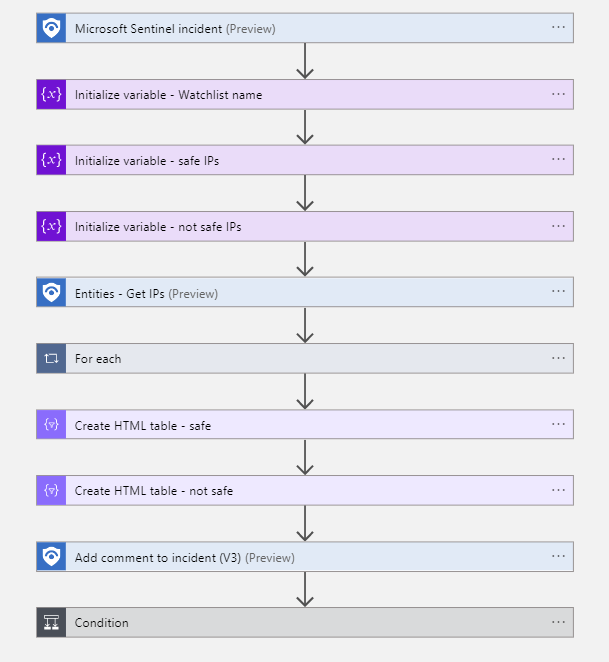

## Prerequisites

1. Managed Identity must have Sentinel Contribor role.
2. The Service principal must have access to the Sentinel Log Analytics workspace
3. The watchlist 'Network addresses' must be present and have IP ranges of known networks defined

## Deployment

## Configuration

### Assign the Sentinel contributor role to the Managed Identity

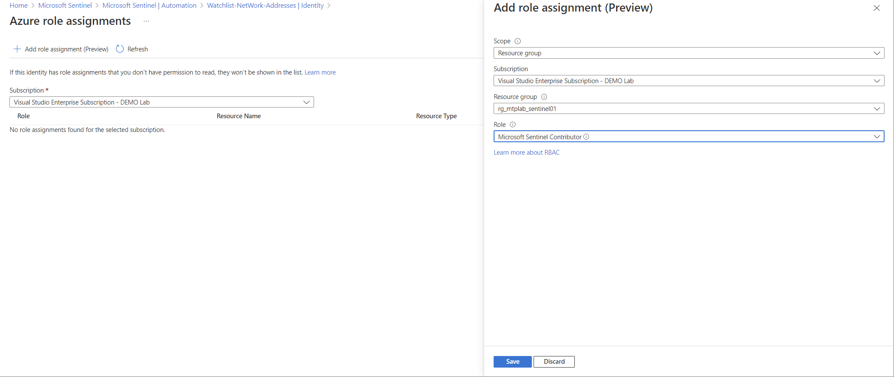

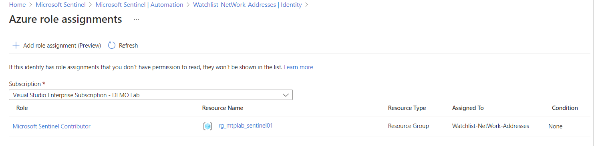

### Configure the connections

Configure the connection to use the Managed Identity
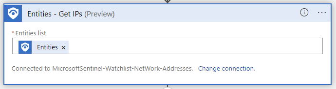

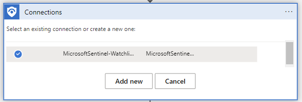

Configure the connection to use the Service Principal that you have setup for Sentinel Playbooks.
> Note! the service principal must have access to the Sentinel Log Analytics workspace

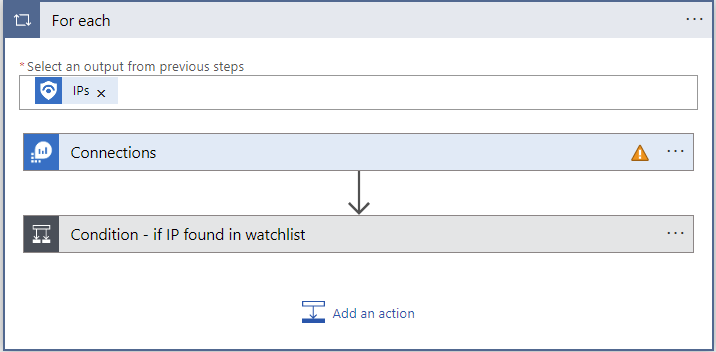

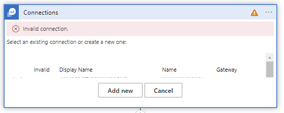

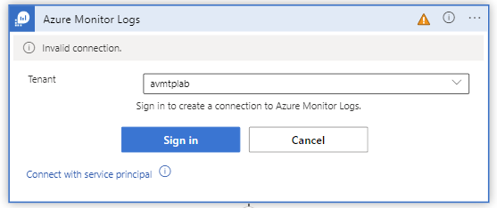

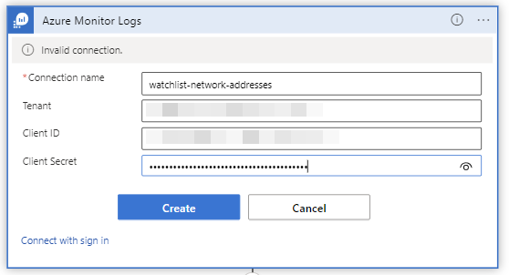

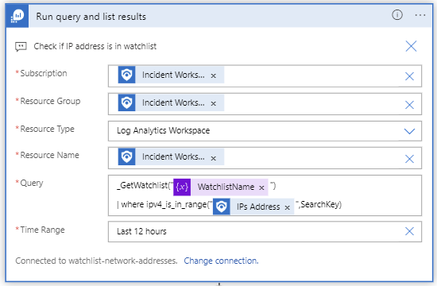

## Results

The playbook writes the results into the incident comment

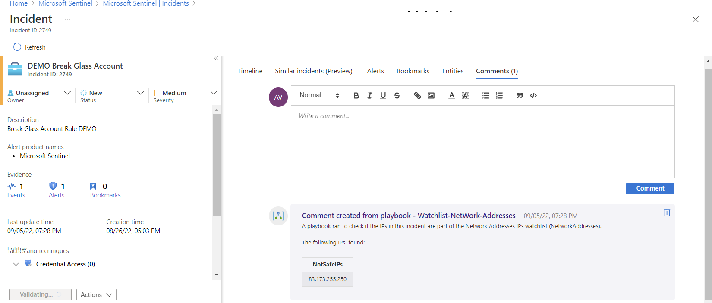
